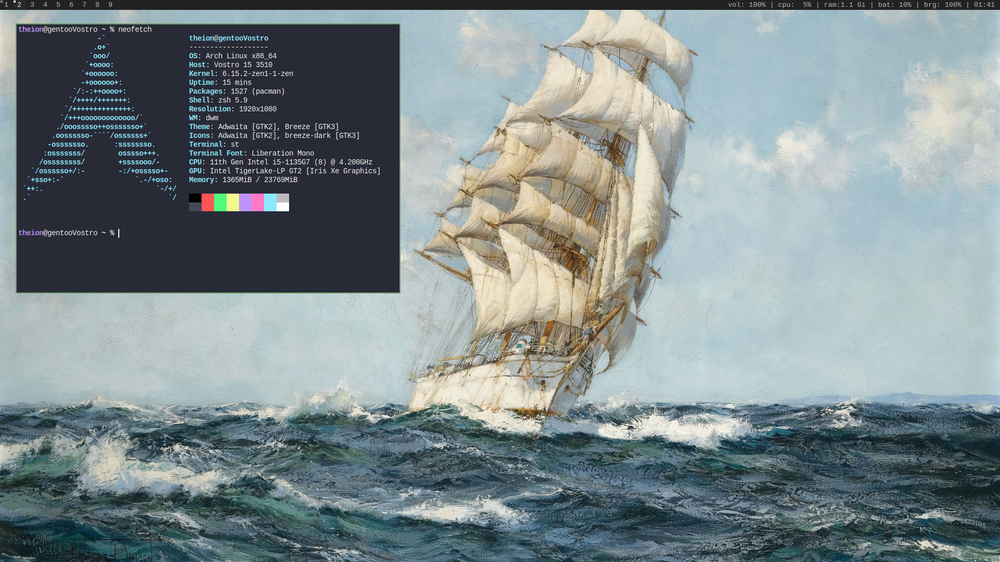

# slcf - Suleyman's linux configuration files
My linux xorg configuration.

slcf only installs configuration to the home directory of the user running the install script
and doesn't affect other users or make system-wide changes but it does overwrites the current configuration,
so, it's recommended to create a new user and run the install script as that user.
If you like the setup then you can install it for your main user.

# Screenshots


# Installation 
1. Make sure to use Zsh or Bash as your interactive shell, have an internet connection, and install at least the build-time dependencies.

2. Create a new user (set shell either to Zsh or Bash):
```
useradd -m -s /bin/zsh <user> 
```

3. configure `install` script

4. run 
``` bash
./install > /dev/null
```
4. Log out, log back in, and run `startx` on the TTY.

# Dependencies 
## Build time dependencies
- curl
- fontconfig (fc-cache command)
- gcc (or most other c compilers)
- ld
- make
- ncurses (tic command)
- pkg-config
- tar

## Build time libraries (not needed if GUI is disabled)
- libx11  
- libxft  
- libxinerama  
- libxext  
- libxrandr  
- libxcrypt 
- imlib2  

note: Some distros require installing `-devel` or `-dev` variants
(e.g. libX11-devel, libx11-dev) for headers and build files. 

## Program dependencies (optional but recommended)
- Xorg                               
- fzf 
- git                                
- lf >= r31                                 
- mpv                                
- nsxiv or sxiv                         
- nvim >= 0.10.3 or vim                           
- picom                              
- firefox
- scrot                              
- setxkbmap                          
- xorg-xinit
- xclip                              
- zathura                            
- zsh or bash

## Script dependencies (optional but recommended)
- brightnessctl                 
- pulseaudio                    
- xgamma                        
- xinput                        
- xset                          
- xwallpaper

# Notes
- Refer to [my dwm build man page](https://git.farajli.net/dwm.git/tree/dwm.1) for keybinds.

# Troubleshooting
- slock gives OOM error, to fix it just run:
    ``` bash
    sudo chown root:root $(which slock)
	sudo chmod u+s $(which slock) 
    ```
- brightnessctl can require privileged user to function, to solve it refer to [brightnessctl page](https://github.com/Hummer12007/brightnessctl#Permissions).
- pulseaudio sometimes doesn't start automatically to start it manually run `pulseaudio --start`.
